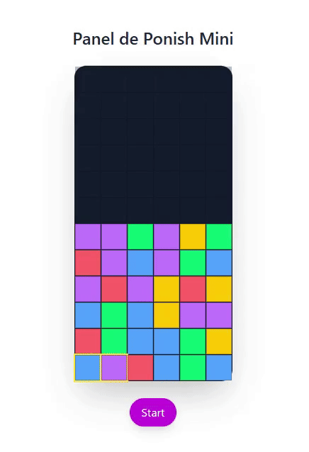

# Panel de Pon-ish

Just a small project I built for fun.  
Created with React, TypeScript, and Tailwind CSS — mostly to experiment and try new things.

It’s similar to *Panel de Pon* on the Super Famicom.  
Swap blocks, match three of the same color, and they disappear.  
The board gradually rises — if it reaches the top, it’s game over.

Based on the original [Panel de Pon (Nintendo, SFC)](https://www.nintendo.com/jp/games/feature/nintendo-classics/s-2034_j/index.html)




---

## Tech stuff

- React
- TypeScript
- Tailwind CSS
- Vite
- Framer Motion (for some animations)

---

## Run it

```bash
pnpm install
pnpm run dev
